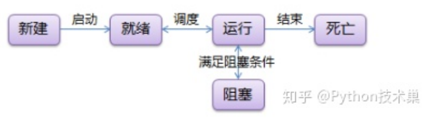

## 2 schedule模块的用法

```
# schedule方法是串行的，也就是说，如果各个任务之间时间不冲突，那是没问题的；如果时间有冲突的话，会串行的执行命令


```


```python
import schedule
import time
 
def job():
    print("I'm working...")
 
schedule.every(10).minutes.do(job)
schedule.every().hour.do(job)
schedule.every().day.at("10:30").do(job)
schedule.every(5).to(10).days.do(job)
schedule.every().monday.do(job)
schedule.every().wednesday.at("13:15").do(job)
 
while True:
    schedule.run_pending()
    time.sleep(1)
```


## 2 threading模块的用法

-  线程有5种状态，状态转换的过程如下图所示： 

  

-  对于任务数量不断增加的程序，每有一个任务就生成一个线程，最终会导致线程数量的失控，例如，整站爬虫，假设初始只有一个链接a，那么，这个时候只启动一个线程，运行之后，得到这个链接对应页面上的b，c，d，，，等等新的链接，作为新任务，这个时候，就要为这些新的链接生成新的线程，线程数量暴涨。对于任务数量不端增加的程序，固定线程数量的线程池是必要的。 

- join()方法会阻塞主线程，当启动线程之后，只有线程全部结束，主线程才会继续执行。

-  唯一要注意的是，这里面job不应当是死循环类型的，也就是说，这个线程应该有一个执行完毕的出口。一是因为线程万一僵死，会是非常棘手的问题；二是下一次定时任务还会开启一个新的线程，执行次数多了就会演变成灾难。如果schedule的时间间隔设置得比job执行的时间短，一样会线程堆积形成灾难，所以，还是需要注意一下的。 

- 所有线程共享一个终端输出（线程所属进程的终端） 

```
Python中如何使用多线程
在python中，使用threading模块来进行程序的多线程操作。threading模块提供了一个Thread类创建线程。


1.target是线程执行函数的名字，函数的名字后面不要带有小括号。
2.args：执行函数所需要的参数，这个参数要以元组的形式去传，如果只有一个元素，后面不要忘了逗号。
3.kwargs：执行函数所需要的参数， 这个参数要以字典方式去传

 

Thread类提供了以下方法:
run(): 用以表示线程活动的方法。
start():启动线程活动。
join([time]): 等待至线程中止，直至启动的线程终止之前一直挂起；除非给出了timeout（秒），否则会一直阻塞。
isAlive(): 返回线程是否活动的。
getName(): 返回线程名。
setName(): 设置线程名。
threading常用方法及属性：
threading.currentThread(): 返回当前的线程变量。
threading.enumerate(): 返回一个包含正在运行的线程的list。正在运行指线程启动后、结束前，不包括启动前和终止后的线程。
threading.activeCount(): 返回当前活跃的线程数，1个主线程+n个子线程。
```

python类的__call__方法

`__call__()`是一种magic method，在类中实现这一方法可以使该类的实例（对象）像函数一样被调用。默认情况下该方法在类中是没有被实现的。使用callable()方法可以判断某对象是否可以被调用。

`__call__()`方法的作用其实是把一个类的实例化对象变成了可调用对象，也就是说把一个类的实例化对象变成了可调用对象，只要类里实现了`__call__()`方法就行。如当类里没有实现`__call__()`时，此时的对象p 只是个类的实例，不是一个可调用的对象，当调用它时会报错：‘Person’ object is not callable.